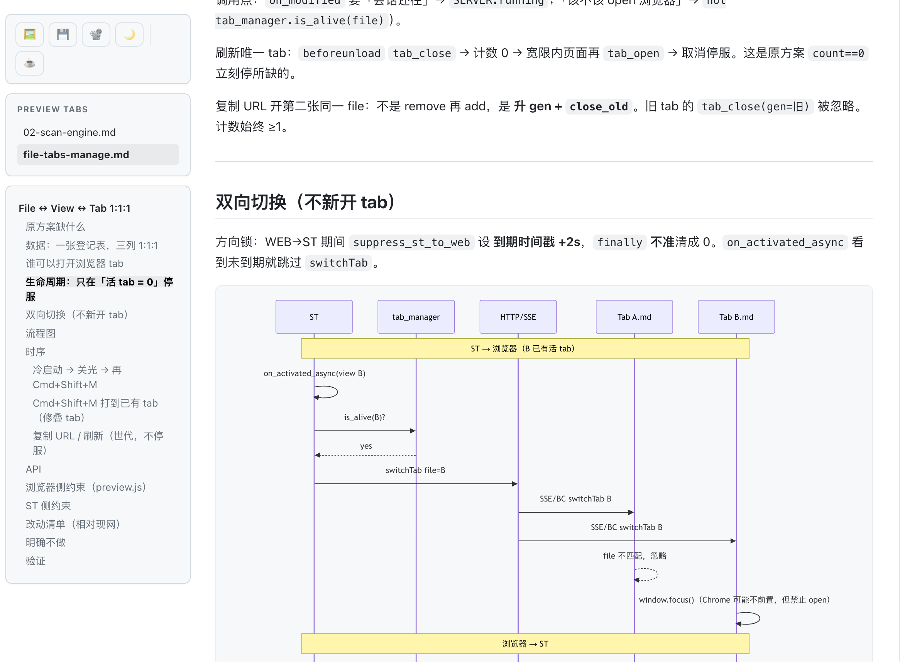

# MarkdownPreviewEnhanced

**English** | [中文](README_zh.md)

Browser live Markdown preview for Sublime Text 4. No extra installs.



## Features

| Preview | Markdown |
| --- | --- |
| ✅ Live preview in the browser | ✅ GitHub-style HTML / CSS |
| ✅ SSE in-place update (no reload) | ✅ Syntax highlighting |
| ✅ Scroll position kept | ✅ GFM task lists |
| ✅ Editor ↔ preview scroll sync | ✅ Footnotes |
| ✅ TOC sidebar | ✅ YAML frontmatter |
| ✅ Relative images (`./img/a.png`) | ✅ KaTeX (`$…$` / `$$…$$`) |
| ✅ Export HTML / PNG / PDF | ✅ Mermaid diagrams |
| ✅ Custom CSS & favicon | ✅ ECharts |
| ✅ macOS / Windows / Linux | ✅ No extra installs |

## Install

Command Palette → `Package Control: Install Package` → `MarkdownPreviewEnhanced`

Or clone this repo to `Packages/MarkdownPreviewEnhanced/` (repo root = package root).

## Usage

Open a `.md` file, then:

| macOS | Windows / Linux | Action |
| --- | --- | --- |
| `Cmd+Shift+M` | `Ctrl+Shift+M` | Open / focus preview |
| `Cmd+Shift+Alt+M` | `Ctrl+Shift+Alt+M` | Close preview (stops the local server) |
| `Cmd+Shift+E` | `Ctrl+Shift+E` | Export HTML |

Command Palette also has Toggle, Close, Refresh, Export HTML, Export PDF.

Edit the file — the browser updates in place (SSE), scroll is kept. Press the shortcut again to focus the existing tab.

Preview toolbar (bottom-left): 🖼️ PNG snapshot, 💾 standalone HTML.

## Settings

Preferences → Package Settings → **MarkdownPreviewEnhanced** → Settings

| Setting | Default | Description |
| --- | --- | --- |
| `mermaid_theme` | `"default"` | `default` / `dark` / `forest` / `neutral` |
| `output_dir` | `""` | Empty = Sublime cache |
| `use_local_server` | `true` | SSE, images, scroll sync |
| `server_port` | `8765` | Tries the next ports if busy |
| `server_idle_seconds` | `0` | Idle auto-stop; `0` = until Close / Sublime exit |
| `browser` | `"auto"` | `auto` / `chrome` / `safari` / `firefox` / `edge` / … |
| `debounce_ms` | `500` | Re-render delay while typing |
| `show_toc` | `true` | TOC sidebar |
| `enable_katex` | `true` | `$...$` / `$$...$$` |
| `enable_task_lists` | `true` | `- [ ]` / `- [x]` |
| `enable_footnotes` | `true` | `[^1]` |
| `strip_frontmatter` | `true` | Strip leading `---` YAML |
| `scroll_sync` | `true` | Editor ↔ preview (needs local server) |
| `custom_css` | `""` | Extra CSS file path (`~` ok) |
| `favicon` | `""` | Empty = bundled icon; `"none"` = no icon; otherwise a local path or `http(s)` URL |

Per-view override:

```jsonc
{
    "markdown_preview_enhanced.mermaid_theme": "forest"
}
```

Requires Sublime Text 4 (Build 4107+). Math, diagrams, and highlighting are vendored — nothing else to install.

Build / PR notes: [CONTRIBUTING.md](CONTRIBUTING.md)

## Support

If this package is useful:

- [Buy Me a Coffee](https://buymeacoffee.com/caffeineoddity)
- WeChat 赞赏:

<p></p>

## License

MIT — [LICENSE](LICENSE)
