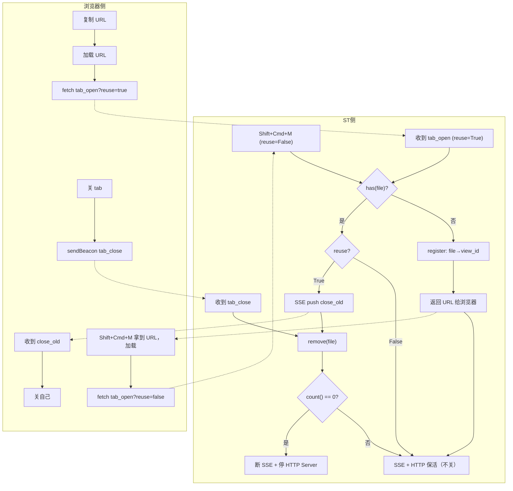
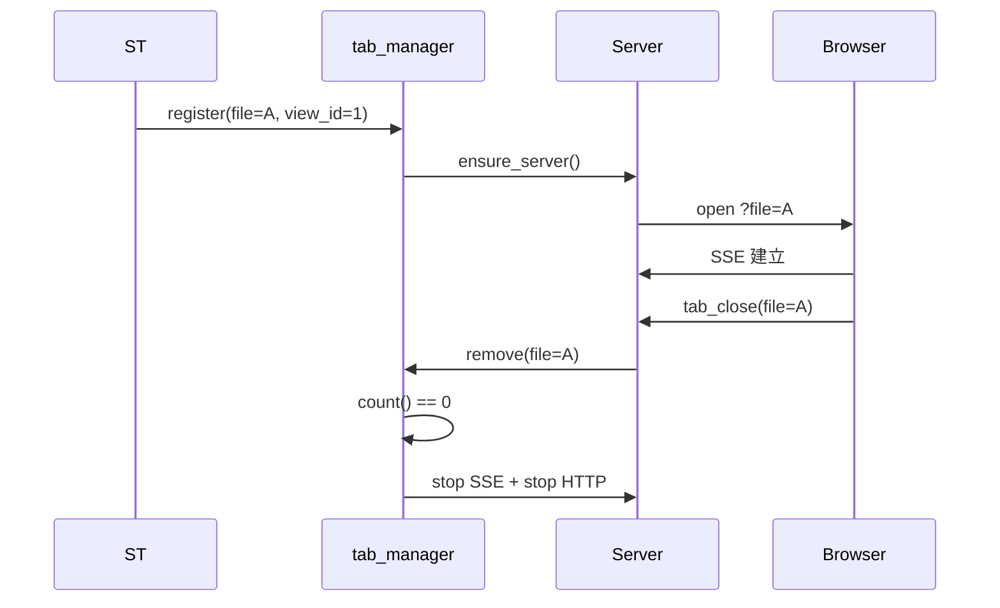
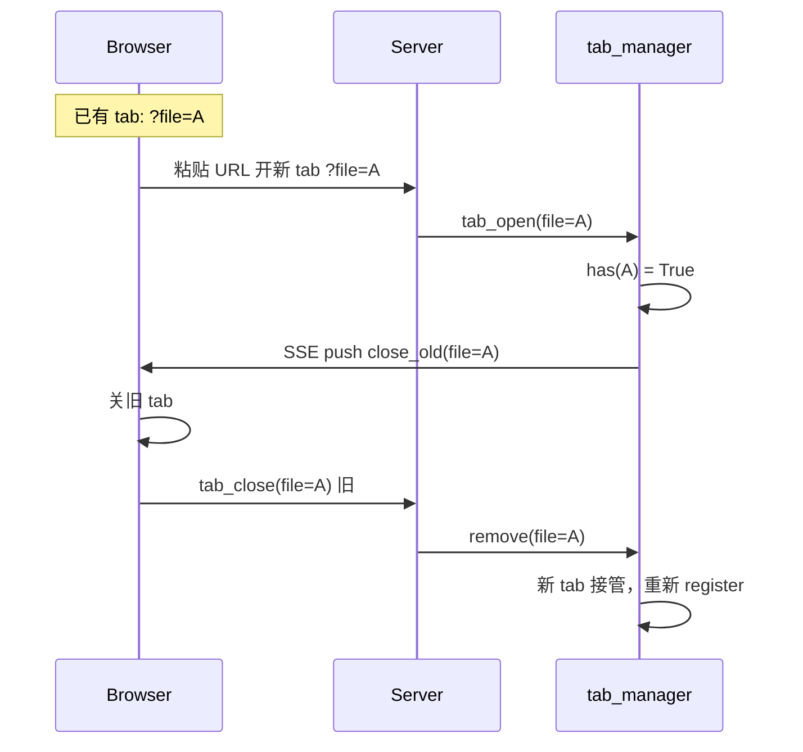
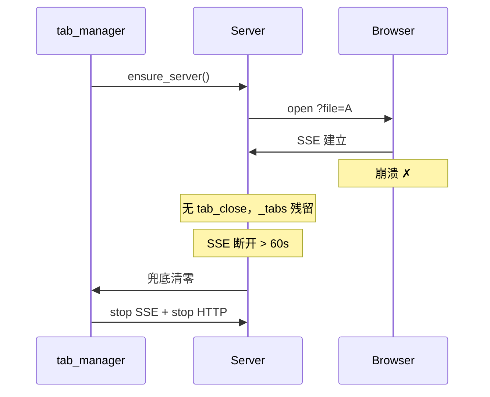

# File ↔ Tab 管理

## 目标

SSE 和 HTTP Server 生命周期绑定到浏览器 tab。**所有浏览器 tab 关闭 → 断 SSE + 停 HTTP Server。**

## 数据结构

一张表，file_path ↔ view_id 1:1：

```python
_tabs = {}   # file_path -> view_id
```

## tab_manager.py

纯增删改查：

```python
_tabs = {}

def register(file_path, view_id):  _tabs[file_path] = view_id
def remove(file_path):             _tabs.pop(file_path, None)
def has(file_path):                return file_path in _tabs
def get_view_id(file_path):        return _tabs.get(file_path)
def count():                       return len(_tabs)
def reset():                       _tabs.clear()
```

断开判定在 `preview_state.py` 的 `_tick`：

```python
if tab_manager.count() == 0:
    stop_server()
```

## 流程图



## 时序图：正常打开 → 关闭



## 时序图：复制 URL 开新 tab



## 时序图：浏览器崩溃兜底



## 改动清单

| 文件 | 改动 |
|------|------|
| `tab_manager.py` | 一张表 `_tabs`，纯增删改查 |
| `preview_state.py` | `mark_browser_open` 调 `register`；`_tick` 改 `count()==0` 才断；SSE 断开 >60s 兜底 |
| `preview_handler.py` | 加 `/api/tab_close` 路由；`/api/stream` 首次连接查 `has`，已有则 SSE push `close_old` |
| `preview.js` | `publishTabBye` 加 `sendBeacon('/api/tab_close')`；收到 `close_old` 关自己 |
| `preview_url.py` | `open_preview_browser` 传 `file + view_id` 给 `register` |

## 设计要点

- **一张表** `_tabs`：`file_path ↔ view_id`，1:1
- **tab_manager.py 纯增删改查**，不管断开逻辑
- **断开判定在 `preview_state.py`**：`count() == 0`
- **一个 file 一个 tab**：复制 URL → 关旧 → 新接管
- **打开**：后端 `register`
- **关闭**：前端 `sendBeacon` → 后端 `remove`
- **崩溃兜底**：SSE 断开 >60s 清零
