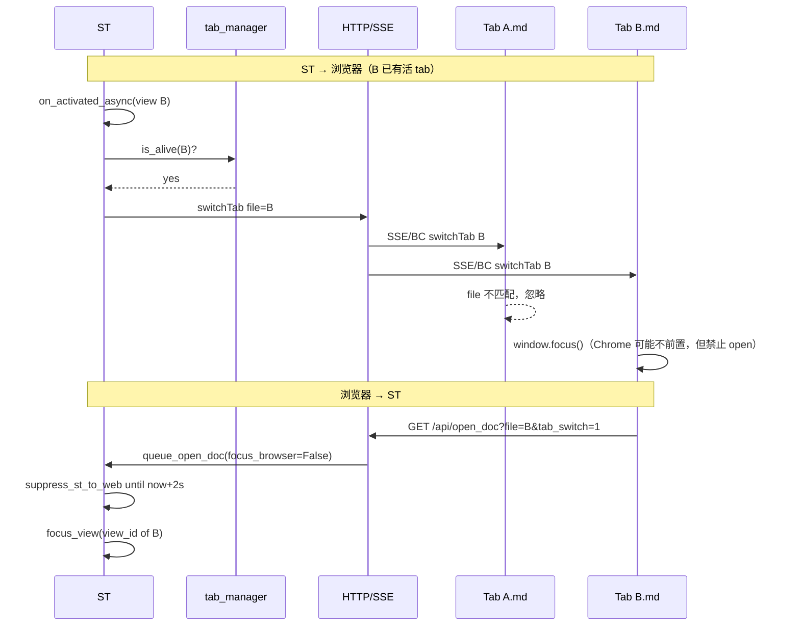
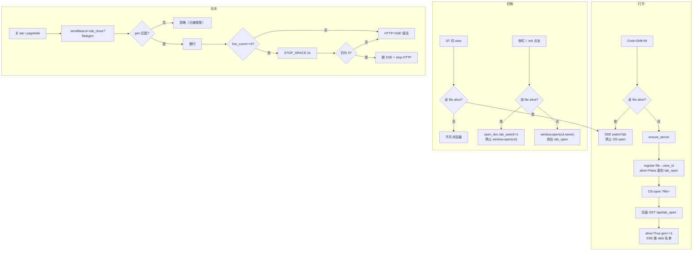
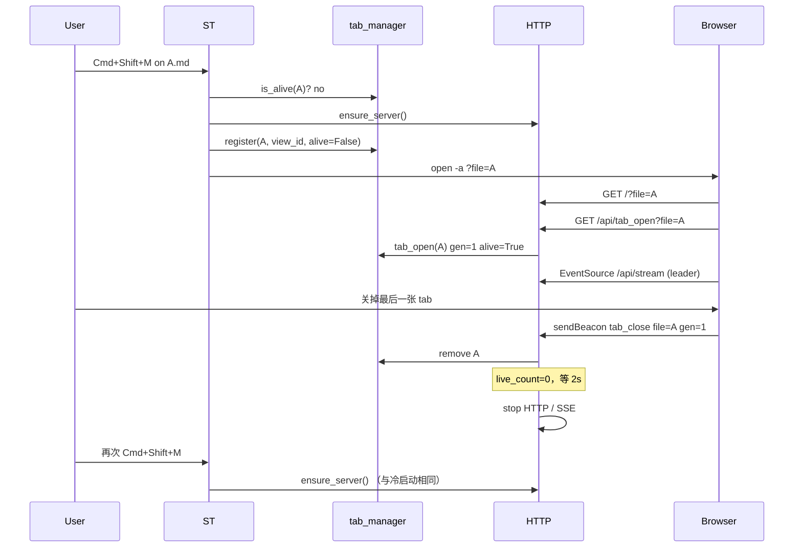
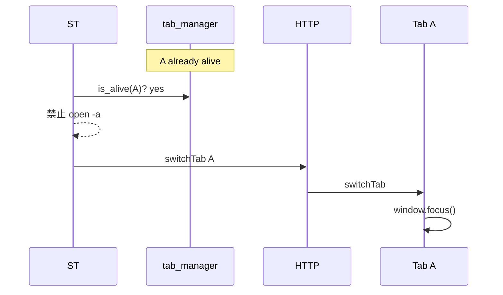
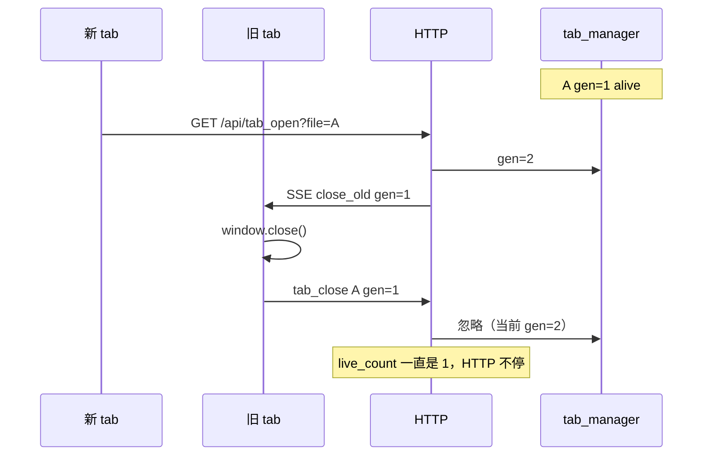

# File ↔ View ↔ Tab 1:1:1

SSE / HTTP 跟**活着的预览 tab 集合**绑定，不是跟「有没有 `_preview_open` 标志」或「当前 tab 是否可见」绑定。

**目标（必须同时成立）：**

1. `file_path` ↔ ST `view_id` ↔ 浏览器 tab **至多 1:1:1**
2. 浏览器切到某 file 的 tab → ST 切到对应 `view_id`
3. ST 切到某 `view_id` → **若该 file 已有活 tab**，推 `switchTab`（不新开）
4. **所有**预览 tab 都关掉 → 断 SSE、停 HTTP
5. 其余时候（切 tab、切 ST、刷新单页、Cmd+Shift+M 复用）**不断** SSE / HTTP
6. 停掉之后，Cmd+Shift+M 重新 `ensure_server` + 建 SSE + 打开该 file 的 tab

Chrome 限制（必须写进方案，不能靠 `window.name` 假装没有）：OS/`open -a` 打开的 tab，事后设 `window.name`，**不能**被其它 tab 的 `window.open(url, name)` 命中。命中失败就会再开一张。所以「1:1」靠 **ST 登记表 + 禁止二次 OS-open** 保证，不靠浏览器命名窗口。

---

## 原方案缺什么

原 `file-tabs-manage.md` 只做了 `file_path → view_id` 一张表和关光停服，和现网撞车的点：

| 问题 | 后果 |
|------|------|
| 表里没有「这个 file 的浏览器 tab 是否还活着」 | 无法回答「该不该 `open -a`」 |
| Cmd+Shift+M 的 `reuse=False` 没写「已有活 tab 则禁止 OS-open」 | 每次 Toggle 都 `open -a`，Chrome 必叠 tab |
| 复制 URL：`close_old` → `tab_close` → `count==0` → 停服，新 tab 还在加载 | 刷新 / 复制 URL 会把唯一会话杀掉 |
| `/api/stream` 首次连接当 `tab_open` | 现网 SSE 是 **全 origin 一条 leader 流**，不是一 file 一连接 |
| 没写 ST ↔ 浏览器互切 | 目标 2、3 不在方案里 |
| 没写 leader hidden 不断 SSE | 现网 `visibilitychange` 里 `disconnectStream()`，切 tab 3s 后 `_preview_open=False`，下一次 publish 再 `open -a` |
| `suppress_st_to_web(False)` 立刻清 2s 窗 | WEB→ST 回声再 `switchTab`，空 url 的 `window.open("", name)` 偶发 about:blank |

现网 `tab_manager.py` 已有 `file_path ↔ view_id` 和 URL 构造，缺的是 **tab 世代 / 存活**，以及把 `_preview_open` / `preview_alive()` 3s 误判换成「活 tab 计数」。

---

## 数据：一张登记表，三列 1:1:1

`tab_manager.py` 仍是唯一登记处（纯增删改查）。生命周期判定在 `preview_state._tick`。

```python
# file_path 是主键（= URL ?file= 解码后的绝对路径）
_tabs = {
    # file_path: {"view_id": int, "gen": int, "alive": bool}
}
```

| 列 | 含义 | 1:1 规则 |
|----|------|----------|
| `file_path` | `/?file=<abs>` 的 canonical key | 同一路径只有一行 |
| `view_id` | 该文件当前绑定的 ST view | 同文件多个 view（分屏）→ **最后一次 activated 的 view 赢** |
| `gen` + `alive` | 浏览器 tab 世代。`tab_open` 把 `alive=True` 并 `gen+=1`；`tab_close` **仅当 gen 匹配** 才 `alive=False` 并删行 | 同一 file 只允许一个活 tab；旧 tab 的 close 不能干掉新 tab |

派生：

```python
def live_count():
    return sum(1 for t in _tabs.values() if t["alive"])
```

没有活 tab 时 HTTP/SSE 才允许停。`view_id` 仍在、但 `alive=False` 的行不应存在——关 tab 时整行删掉；ST 侧之后再 bind 是新会话。

浏览器不另做权威表。侧栏 Preview Tabs 以 **ST 推的名单** 为准（SSE `tabs` 事件），BroadcastChannel `tab-hello` 只作加速，对不上时听服务器。

---

## 谁可以打开浏览器 tab

只有一条 OS 打开入口：`BrowserSession.open`（macOS 即 `open -a`）。

```
允许 OS-open  ⟺  Cmd+Shift+M（或等价 command）且 该 file 没有 alive tab
```

其余全部禁止 OS-open：

| 事件 | 已有该 file 的活 tab | 没有该 file 的活 tab |
|------|----------------------|----------------------|
| Cmd+Shift+M | **禁止** OS-open；SSE `switchTab` | OS-open 一次，register，等 `tab_open` |
| ST 切 view | SSE `switchTab` | **什么都不开**（目标 3 的「如果」） |
| 侧栏点已有文档 | **禁止** `window.open(url)`；BC `focus-tab` + `/api/open_doc?tab_switch=1` | 有手势：`window.open(url, name)` 创建唯一 tab |
| `.md` 链接 | 同上 | 同上 |
| 复制 URL 粘贴 | `tab_open` 发现已 alive → SSE `close_old(gen=旧)`，新 tab 升 gen 接管 | 当新会话 `tab_open` |
| 渲染 / publish / 滚合同步 | 永不 OS-open | 永不 OS-open |

`render_view(..., focus_browser=True)` 这条短路必须删掉。Toggle 不再把 `focus_browser` 传进 publish。

浏览器侧 `window.open` 规则（防叠 tab）：

```
若 ST/BC 名单里该 file 已 alive:
    w = window.open("", name)        # 不带 URL
    若 w 是 about:blank → w.close()  # name 没命中，绝不留下空页
    只做 BC focus-tab + open_doc
否则:  # 真正的第一张
    window.open(url, name)
```

`switchTab` 处理函数里同样：**禁止** `window.open("", name)` 除非调用者就是目标 tab 自己（`data.file === channelFile` 时 `window.focus()`，不再 `open`）。空 url 的 `open` 是 about:blank 源。

---

## 生命周期：只在「活 tab = 0」停服

```
启动: Cmd+Shift+M 且 live_count==0 → ensure_server() → OS-open → 页面 tab_open + leader 连 /api/stream
存活: live_count>=1 → HTTP、SSE 一直开。leader hidden 也不断 EventSource
停止: 最后一次匹配 gen 的 tab_close 使 live_count==0，宽限 STOP_GRACE 秒（覆盖 F5）后 stop_server()
兜底: 活 tab>0 但 SSE 全断超过 CRASH_IDLE 秒（崩溃、无 sendBeacon）→ 清表 + stop_server()
复活: 停掉后 Cmd+Shift+M → 与冷启动相同
```

推荐常数：`STOP_GRACE=2s`，`CRASH_IDLE=60s`。现网 `preview_alive` 的 3s、`SSE_IDLE` 的 10s、hidden 断流全部去掉。

`_preview_open` 不再单独当真相。需要布尔值的地方改问 `tab_manager.live_count() > 0 or SERVER.running`（按调用点：`on_modified` 要「会话还在」→ `SERVER.running`；「该不该 open 浏览器」→ `not tab_manager.is_alive(file)`）。

刷新唯一 tab：`beforeunload` `tab_close` → 计数 0 → 宽限内页面再 `tab_open` → 取消停服。这是原方案 `count==0` 立刻停所缺的。

复制 URL 开第二张同一 file：不是 remove 再 add，是 **升 gen + `close_old`**。旧 tab 的 `tab_close(gen=旧)` 被忽略。计数始终 ≥1。

---

## 双向切换（不新开 tab）

方向锁：WEB→ST 期间 `suppress_st_to_web` 设 **到期时间戳 +2s**，`finally` **不准**清成 0。`on_activated_async` 看到未到期就跳过 `switchTab`。



侧栏点击已有文档：只走「浏览器 → ST」+ BC `focus-tab`，**不** `window.open(url)`。

Chrome 不能可靠前置 OS 打开的后台 tab。协议仍要推 `switchTab` / `focus-tab`；**失败时也不许新开**。这是 1:1 优先于「一定前置」的取舍。

---

## 流程图



---

## 时序

### 冷启动 → 关光 → 再 Cmd+Shift+M



### Cmd+Shift+M 打到已有 tab（修叠 tab）



### 复制 URL / 刷新（世代，不停服）



---

## API

| 方法 | 路径 | 作用 |
|------|------|------|
| GET | `/api/tab_open?file=` | 登记活 tab；若该 file 已 alive，升 gen，向旧 gen 推 `close_old` |
| POST/beacon | `/api/tab_close?file=&gen=` | gen 匹配才删行 |
| GET | `/api/open_doc?file=&tab_switch=1` | 只切 ST view，`focus_browser=False` |
| SSE | `switchTab` `{file}` | 目标 tab `window.focus()`，禁止 `window.open` |
| SSE | `close_old` `{file,gen}` | 仅 `channelFile+gen` 匹配的页 `window.close()` |
| SSE | `tabs` `{files:[...]}` | 权威侧栏名单 |
| SSE | `/api/stream` | **仍是全局一条**。不在这里做 tab_open |

`tab_open` / `tab_close` 必须幂等。`pagehide` 与 `beforeunload` 可能各打一次 close，第二次 gen 不匹配或行已删则忽略。

不要用 `/api/stream` 连接当 tab 登记：leader 选举下只有一个 EventSource。

---

## 浏览器侧约束（`preview.js`）

1. **Leader 在 `hidden` 时不断 `/api/stream`。** `visibilitychange` 只用于「变为 visible → `notifyDocSwitch`」。`disconnectStream` 只留在真正卸载（`pagehide` 非 persisted / `beforeunload`）和卸任 leader。
2. 每个页面启动：读 `?file=` → `GET /api/tab_open` → 再参与 leader 选举。
3. 卸载：`sendBeacon('/api/tab_close?file=&gen=')`。bfcache `persisted` 不 close。
4. 侧栏渲染以最后一次 SSE `tabs` 为准。
5. `switchToPreview`：已 alive 不带 URL 的 `open`；about:blank 立刻 `close`。
6. 自己的 `window.name` 仍设为 `mdpp_` + encodeURIComponent(file)，给「从本页 `window.open` 出去的子 tab」复用；**不作为 OS-open tab 的复用依据**。

---

## ST 侧约束

1. Toggle：`is_alive(file)` 则只 `set_active_doc` / `switchTab`；否则 `ensure_server` + register + `open_preview_browser`。
2. `publish` / `render_view`：**默认永远不 OS-open**。打开浏览器只走 Toggle（以及「该 file 尚无活 tab」这一支）。
3. `on_activated_async`：会话活着且该 file `alive` 才 `switchTab`；方向锁未到期则跳过。
4. `open_doc_from_browser`：只 `focus_view`；`suppress_st_to_web` 用 +2s 时间戳，**finally 不清零**。`render_view(..., open_browser=False)`。
5. `_tick`：`live_count()==0` 进入 `STOP_GRACE`；宽限内又 `tab_open` 则取消。SSE 全无且 `CRASH_IDLE` 到 → 清表停服。**不要**再根据 `preview_alive()` 3s 把会话打成关闭。
6. 无路径的未保存 buffer：不进登记表，不 OS-open（或沿用现网：无 `?file=` 的频道）。不破坏已保存文件的 1:1。

---

## 改动清单（相对现网）

| 文件 | 改动 |
|------|------|
| `mpe_core/tab_manager.py` | 在现有 `file↔view` 上加 `gen/alive`；`register/tab_open/tab_close/is_alive/live_count`；`preview_url` 保留 |
| `mpe_core/preview_state.py` | `_tick` 按 `live_count` + grace / crash idle 停服；删 3s `preview_alive` 误关；`suppress` 只设到期、不清零；`mark_browser_open` 不再是「可以再 open」的依据 |
| `mpe_core/preview_state_core.py` | SSE 增加 `close_old`、`tabs`；`queue_open_doc` 默认 `focus_browser=False` |
| `mpe_core/preview_handler.py` | `/api/tab_open`、`/api/tab_close`；**不**在 `/api/stream` 里登记 tab |
| `mpe_core/render.py` | `need_open` 去掉 `or focus_browser`；publish 不因「会话在」就 open |
| `mpe_core/preview_url.py` / `browser.py` | OS-open 仅由 Toggle 在 `not is_alive(file)` 时调用 |
| `commands/__init__.py` | Toggle 按 `is_alive` 分支：复用 vs 冷启动 |
| `MarkdownPreviewEnhanced.py` | `on_activated_async` 看 `is_alive(file)`；方向锁尊重到期时间 |
| `assets/preview.js` | hidden 不断 SSE；tab_open/close；`switchToPreview` / `switchTab` 禁止对已有 tab 带 URL 的 `open`；about:blank 关掉 |

---

## 明确不做

- 不恢复 AppleScript / 按 URL 扫 Chrome tab（跨平台已去掉，1:1 用登记表保证）
- 不把多文件合成单 tab SPA（与「一 file 一 tab」目标相反）
- 不保证 Chrome 一定把后台 OS-tab 前置（保证的是**不叠 tab**）
- 不在 SSE 连接上做 per-file 登记

---

## 验证

1. Cmd+Shift+M 开 A → 再按一次 → **仍一张** tab，HTTP 不停。
2. 再开 B.md，Cmd+Shift+M → 第二张 tab；从 A 切 B、从 B 切 A：ST view 跟着切；浏览器侧尽力前置且 **不出现第三张**。
3. 侧栏点已打开的文档 → ST 切 view，tab 数不变。
4. 复制 A 的 URL 新开 → 旧 A 关掉，总数不变，HTTP 不停。
5. 刷新唯一 tab → 宽限内 HTTP 仍在，页面重新 `tab_open`。
6. 关掉所有预览 tab → 2s 内停 HTTP；再 Cmd+Shift+M → 服务回来，一张新 tab。
7. 只切浏览器 tab、不关 → SSE 保持（leader hidden 也不断），10s/3s 后 **不会**停服、不会再 `open -a`。
8. 浏览器强制杀进程 → ≤60s 停服。
